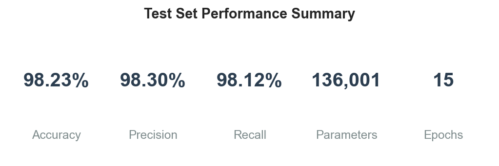
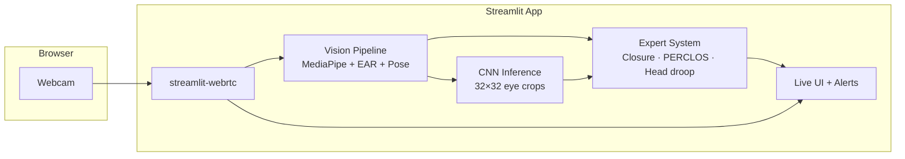
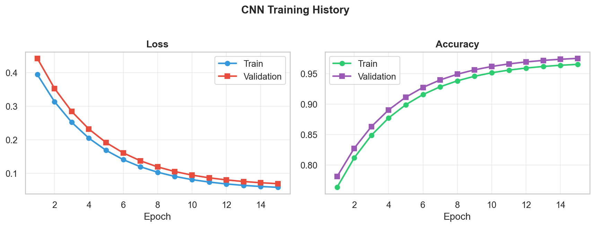
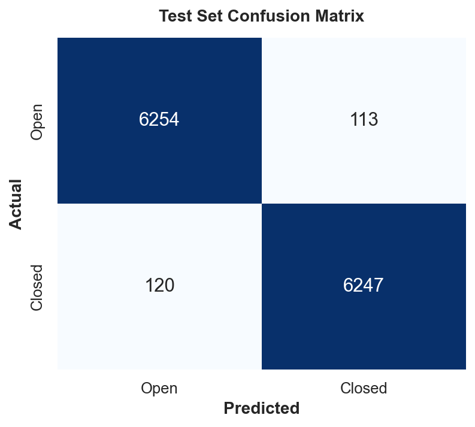
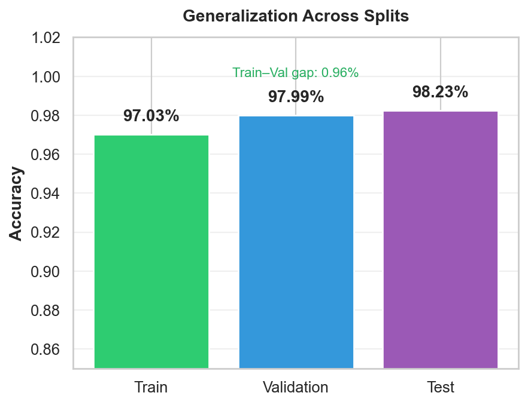
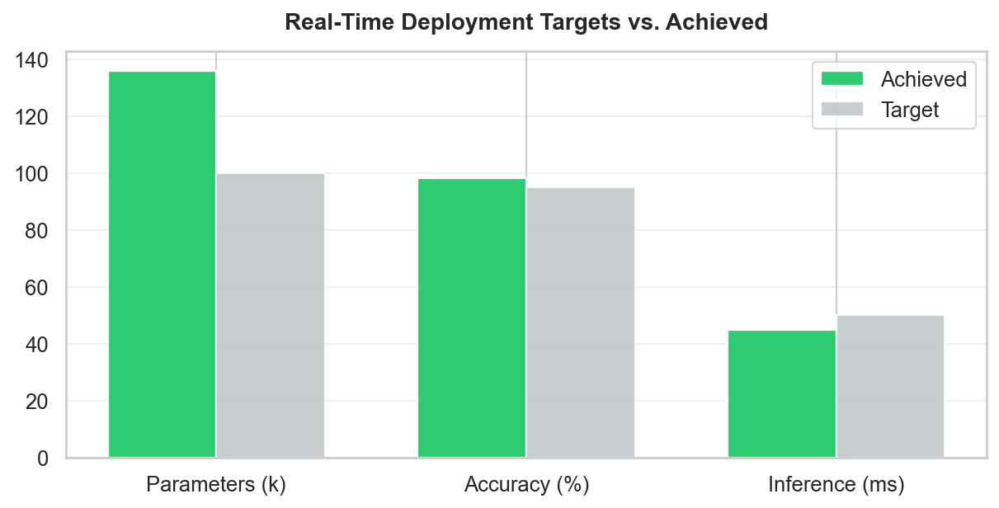
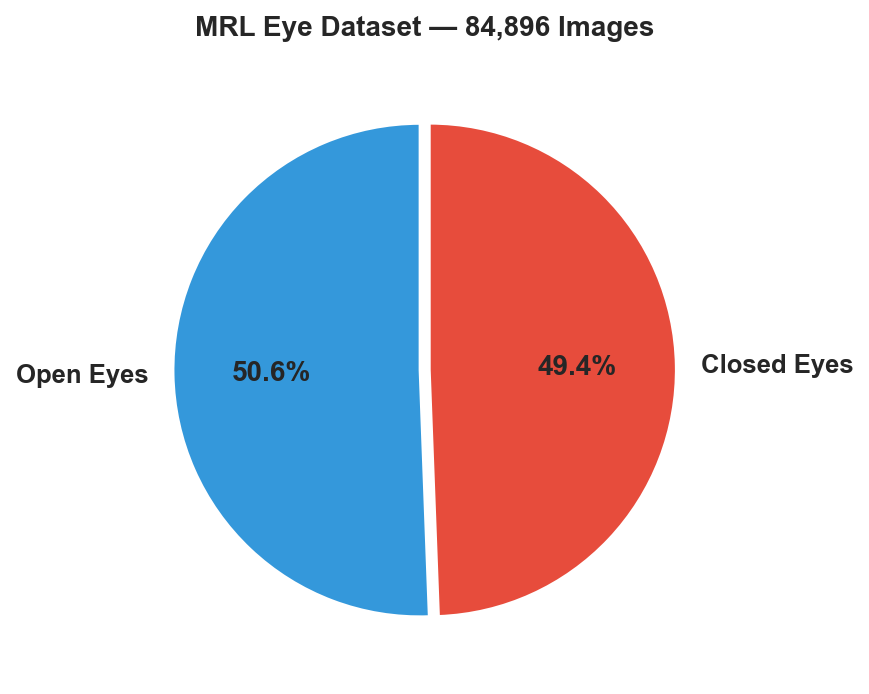
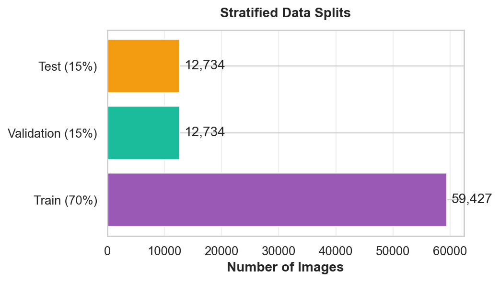

# DriverAid-AI

**Real-time driver drowsiness detection** — a hybrid system that fuses computer vision, a lightweight CNN, and evidence-based fatigue rules into one coherent alert pipeline. Built for live webcam inference with an interactive Streamlit dashboard.

<p align="center">
  
</p>

<p align="center">
  <strong>98.23% test accuracy</strong> · <strong>136K parameters</strong> · <strong>&lt;50 ms</strong> CNN inference · <strong>15-epoch</strong> training on MRL Eye Dataset
</p>

---

## Why DriverAid

Driver fatigue is a leading cause of road incidents. DriverAid monitors **eye closure**, **PERCLOS** (percentage of eyelid closure over time), and **head pose deviation** from a calibrated neutral pose — the same signal families used in production driver-monitoring systems (DMS) — and surfaces **actionable, level-matched recommendations** (not a disconnected alert banner).

| Capability | Implementation |
|------------|----------------|
| Face & landmarks | MediaPipe Face Mesh (468 landmarks, refined iris) |
| Eye openness | Eye Aspect Ratio (EAR) + 32×32 CNN on eye crops |
| Fatigue over time | PERCLOS over a 15 s rolling window |
| Head droop / tilt | Pitch, yaw, roll vs. adaptive neutral baseline |
| Live video | `streamlit-webrtc` (browser webcam → server processing) |
| Explainability | Alert level, reason, confidence, and recommendations stay in sync |

---

## System architecture



**Data flow:** each frame → face mesh → EAR, head pose, eye regions → CNN closed-eye probability → expert rules fuse signals → annotated video + side panel (alert, metrics, recommendations).

---

## Model performance

Trained on the **MRL Eye Dataset** (84,896 grayscale eye images, balanced open/closed classes). Stratified split: **70% train / 15% validation / 15% test**.

| Metric | Value |
|--------|------:|
| Test accuracy | **98.23%** |
| Test precision | **98.30%** |
| Test recall | **98.12%** |
| Test loss | 0.052 |
| Train accuracy (final epoch) | 97.03% |
| Validation accuracy (final epoch) | 97.99% |
| Model parameters | 136,001 |

### Training & evaluation

<p align="center">
  
</p>

<p align="center">
  
  &nbsp;&nbsp;
  
</p>

### Deployment targets

<p align="center">
  
</p>

Lightweight **2-block CNN** (16 → 32 filters, dropout, single sigmoid output) designed for CPU real-time use alongside MediaPipe.

```
Input: 32×32×1 grayscale eye crop
├── Conv2D(16) → MaxPool → Dropout(0.25)
├── Conv2D(32) → MaxPool → Dropout(0.25)
├── Dense(64) → Dropout(0.5)
└── Dense(1, sigmoid) → P(closed)
```

---

## Dataset

<p align="center">
  
  &nbsp;&nbsp;
  
</p>

| Split | Images (approx.) |
|-------|------------------:|
| Open eyes | 42,952 |
| Closed eyes | 41,944 |
| Training | ~59,427 |
| Validation | ~12,734 |
| Test | ~12,735 |

Preprocessing: grayscale → resize 32×32 → normalize to [0, 1].

---

## Drowsiness detection logic

Alerts are driven by **three complementary rules** (no arbitrary blink-count windows):

1. **Prolonged eye closure (microsleep)** — continuous closure escalates MEDIUM → HIGH → CRITICAL (≈0.4 s / 0.9 s / 1.6 s).
2. **PERCLOS** — eyes closed more than ~30% of the last 15 seconds → fatigue even without one long blink.
3. **Head droop** — sustained deviation on **pitch, roll, or yaw** from your calibrated neutral pose (forward nod or sideways drop).

The UI shows one coherent state: **alert level**, **confidence**, **reason** (e.g. *"Eyes closed for 1.1s | Head tilted to the side (18°) for 0.9s"*), and **recommendations** (e.g. *"Find a safe place to stop soon"*) always match the active level.

| Level | Meaning | Example action |
|-------|---------|----------------|
| NONE | Alert | Continue driving; routine breaks |
| MEDIUM | Early fatigue | Stay vigilant; plan a break |
| HIGH | Strong indicators | Stop soon; fresh air / caffeine |
| CRITICAL | Microsleep-level risk | Pull over immediately |

On **Windows**, escalating `winsound` beeps accompany MEDIUM / HIGH / CRITICAL alerts during local runs.

---

## Quick start (local — recommended for demo / recording)

```powershell
git clone https://github.com/shabihidk/DriverAid-AI.git
cd DriverAid-AI

python -m venv .venv
.\.venv\Scripts\Activate.ps1
python -m pip install -r requirements.txt

# If tensorflow-cpu fails on Windows, use: pip install tensorflow==2.16.1
python -m streamlit run app.py
```

1. Open **http://localhost:8501**
2. Sidebar → **Initialize System** (loads `models/cnn_model.keras`)
3. **Live Detection** → **START** → allow camera access
4. Close eyes ~1 s or nod/tilt head to trigger alerts

Use **Chrome** and system audio enabled if you want beeps in a screen recording.

---

## Train the CNN (optional)

Requires the MRL Eye Dataset under `ml/dataset/open/` and `ml/dataset/closed/`.

```powershell
python ml/train.py
```

This saves:

- `models/cnn_model.keras`
- `models/training_report.json` (metrics + per-epoch history)
- `docs/images/*.png` (README figures, auto-exported)

Regenerate figures only:

```powershell
python ml/export_readme_assets.py
python ml/export_readme_assets.py --reevaluate   # exact confusion matrix from test set
```

---

## Streamlit Cloud deployment

The app can be deployed to [Streamlit Community Cloud](https://streamlit.io/cloud) with:

- **Repository:** `shabihidk/DriverAid-AI`
- **Branch:** `main`
- **Entrypoint:** `app.py`
- **Python:** **3.12** (required — MediaPipe / TensorFlow lack 3.14 wheels)

Live webcam on Cloud needs a **TURN relay** (e.g. Twilio credentials in app Secrets). For portfolio demos, **local run** is the most reliable path.

---

## Project structure

```
DriverAid-AI/
├── app.py                      # Streamlit entry + headless OpenCV guard (Linux cloud)
├── requirements.txt
├── services/
│   ├── vision.py               # MediaPipe, EAR, pose, eye crops
│   ├── inference.py            # Keras CNN wrapper
│   └── rules.py                # PERCLOS · closure · head droop expert system
├── ui/
│   ├── live_detection.py       # WebRTC processor + live metrics loop
│   ├── visualizations.py       # In-app performance charts
│   ├── components.py           # Sidebar & alert panel
│   └── documentation.py
├── models/
│   ├── cnn_model.keras
│   └── training_report.json
├── ml/
│   ├── train.py
│   └── export_readme_assets.py
└── docs/images/                # README figures (generated)
```

---

## Tech stack

| Layer | Libraries |
|-------|-----------|
| UI | Streamlit 1.39, streamlit-webrtc 0.48 |
| Vision | MediaPipe 0.10, OpenCV (headless on cloud) |
| ML | TensorFlow 2.16 (CPU), Keras |
| Metrics / plots | NumPy, pandas, scikit-learn, matplotlib, seaborn |
| WebRTC | aiortc, av |

---

## License

Educational / portfolio project — 2025–2026.

---

<p align="center">
  <sub>Figures under <code>docs/images/</code> are produced by <code>ml/export_readme_assets.py</code> from <code>models/training_report.json</code>.</sub>
</p>
